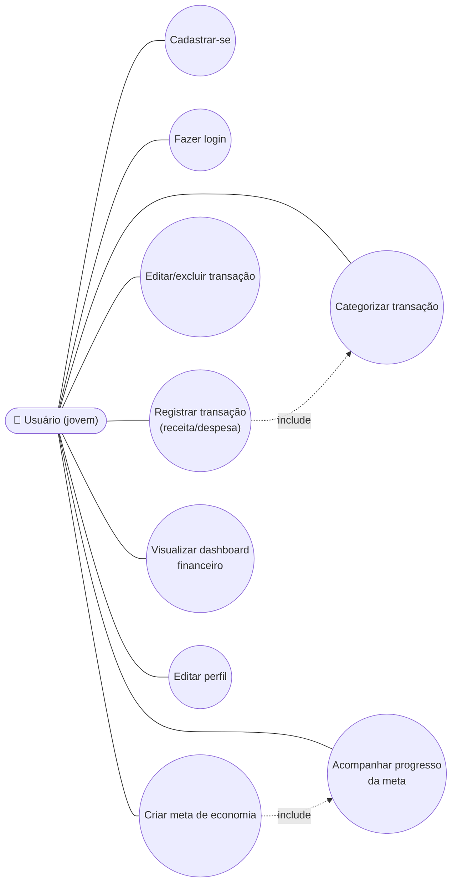
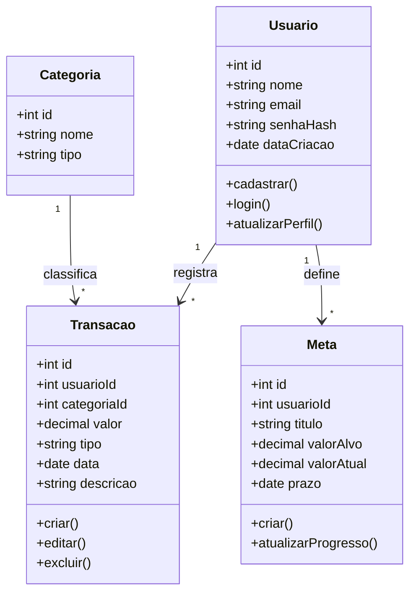

# Diagramas UML — FinZip

> Visão inicial do sistema (CP4). Serão revisados e atualizados nos Checkpoints 5 e 6 conforme o desenvolvimento avança.

## Diagrama de Casos de Uso

## Diagrama de Classes

