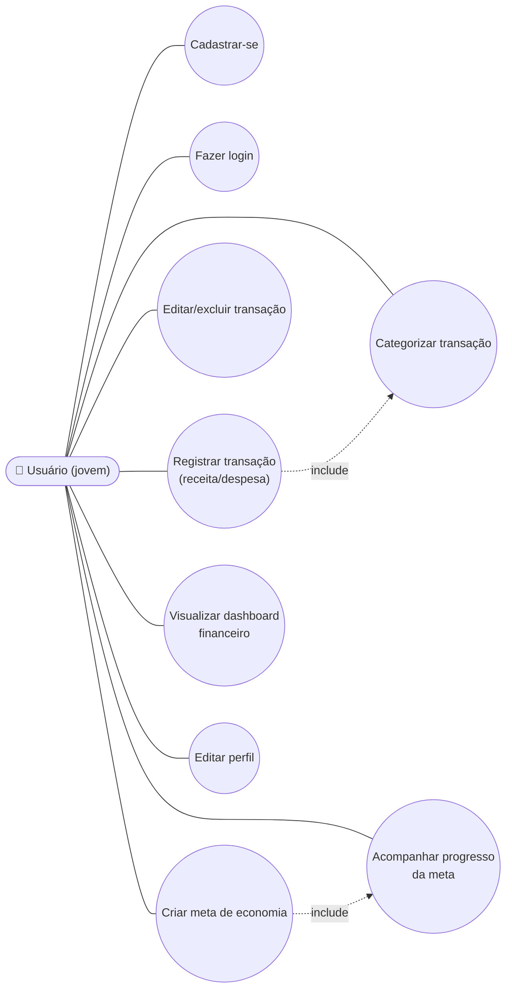
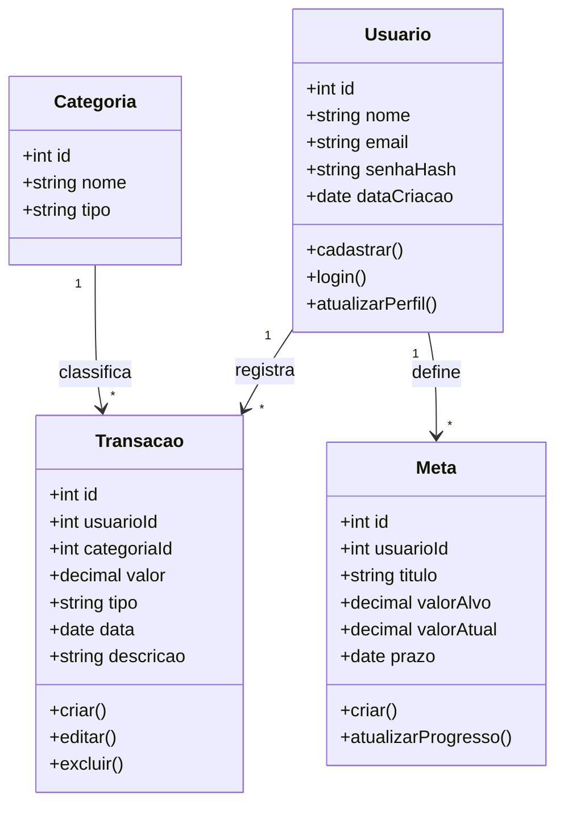
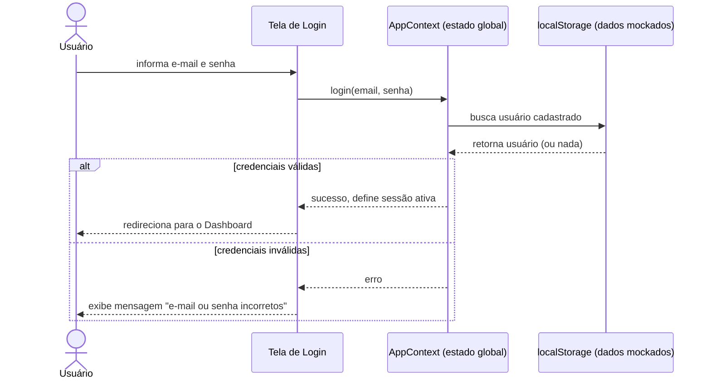

# Diagramas UML — FinZip

> Documento vivo: os diagramas de Casos de Uso e de Classes foram criados no CP4 (visão inicial do sistema). No CP5, adicionamos os diagramas de Sequência e de Atividade, já refletindo os fluxos implementados no protótipo funcional (com dados mockados, sem banco de dados real). Serão revisados novamente no CP6, quando o sistema passar a ter persistência real.

## Diagrama de Casos de Uso

```mermaid
flowchart LR
    Usuario(["🧑 Usuário (jovem)"])

    UC1(("Cadastrar-se"))
    UC2(("Fazer login"))
    UC3(("Registrar transação\n(receita/despesa)"))
    UC4(("Categorizar transação"))
    UC5(("Editar/excluir transação"))
    UC6(("Criar meta de economia"))
    UC7(("Acompanhar progresso\nda meta"))
    UC8(("Visualizar dashboard\nfinanceiro"))
    UC9(("Editar perfil"))

    Usuario --- UC1
    Usuario --- UC2
    Usuario --- UC3
    Usuario --- UC4
    Usuario --- UC5
    Usuario --- UC6
    Usuario --- UC7
    Usuario --- UC8
    Usuario --- UC9

    UC3 -.include.-> UC4
    UC6 -.include.-> UC7
```

## Diagrama de Classes

```mermaid
classDiagram
    class Usuario {
        +int id
        +string nome
        +string email
        +string senhaHash
        +date dataCriacao
        +cadastrar()
        +login()
        +atualizarPerfil()
    }

    class Transacao {
        +int id
        +int usuarioId
        +int categoriaId
        +decimal valor
        +string tipo
        +date data
        +string descricao
        +criar()
        +editar()
        +excluir()
    }

    class Categoria {
        +int id
        +string nome
        +string tipo
    }

    class Meta {
        +int id
        +int usuarioId
        +string titulo
        +decimal valorAlvo
        +decimal valorAtual
        +date prazo
        +criar()
        +atualizarProgresso()
    }

    Usuario "1" --> "*" Transacao : registra
    Usuario "1" --> "*" Meta : define
    Categoria "1" --> "*" Transacao : classifica
```

## Diagrama de Sequência — Login (CP5)

> Reflete a implementação atual: sem back-end/banco real, a autenticação é validada no próprio front-end, contra os dados mockados salvos no `localStorage` do navegador.

```mermaid
sequenceDiagram
    actor Usuario as Usuário
    participant Tela as Tela de Login
    participant Ctx as AppContext (estado global)
    participant LS as localStorage (dados mockados)

    Usuario->>Tela: informa e-mail e senha
    Tela->>Ctx: login(email, senha)
    Ctx->>LS: busca usuário cadastrado
    LS-->>Ctx: retorna usuário (ou nada)
    alt credenciais válidas
        Ctx-->>Tela: sucesso, define sessão ativa
        Tela-->>Usuario: redireciona para o Dashboard
    else credenciais inválidas
        Ctx-->>Tela: erro
        Tela-->>Usuario: exibe mensagem "e-mail ou senha incorretos"
    end
```

## Diagrama de Atividade — Registrar transação (CP5)

```mermaid
flowchart TD
    Start([Início]) --> Abre[Usuário abre a tela de Transações]
    Abre --> Clica[Clica em "Nova transação"]
    Clica --> Preenche[Preenche tipo, categoria, valor, data e descrição]
    Preenche --> Valida{Dados válidos?}
    Valida -- Não --> Erro[Exibe mensagem de erro no formulário]
    Erro --> Preenche
    Valida -- Sim --> Salva[Salva a transação no estado global / localStorage]
    Salva --> Atualiza[Atualiza o Dashboard e a lista de transações]
    Atualiza --> End([Fim])
```

